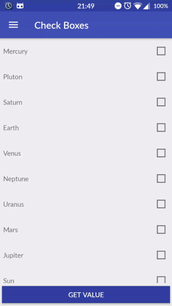
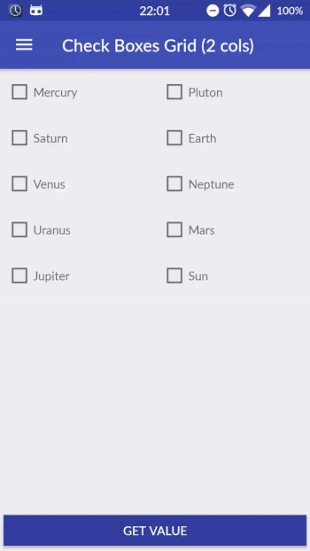
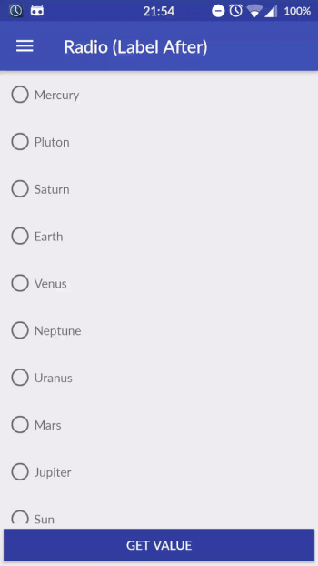
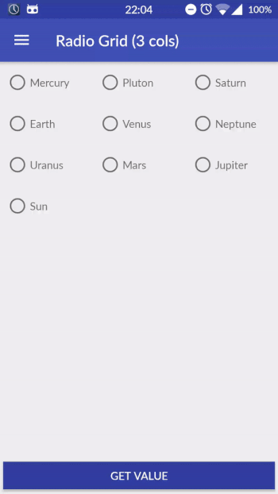

# Compound Button Group


[](https://android-arsenal.com/api?level=10)
[](https://android-arsenal.com/details/1/5669)

An Android library to easily implement compound buttons

## Installation

#### Gradle
Add Gradle dependency:

```groovy
dependencies {
  compile 'com.llollox.androidprojects:compoundbuttongroup:1.0.2'
}
```

#### Maven
```xml
<dependency>
  <groupId>com.llollox.androidprojects</groupId>
  <artifactId>compoundbuttongroup</artifactId>
  <version>1.0.2</version>
  <type>pom</type>
</dependency>
```

## Usage

#### Check Box



```xml
<com.llollox.androidprojects.compoundbuttongroup.CompoundButtonGroup
    android:layout_width="match_parent"
    android:layout_height="wrap_content"
    app:entries="@array/planets"
    app:compoundType="check_box"/>
```

#### Check Box Grid (2 Cols, Label After)



```xml
<com.llollox.androidprojects.compoundbuttongroup.CompoundButtonGroup
    android:layout_width="match_parent"
    android:layout_height="wrap_content"
    app:entries="@array/planets"
    app:compoundType="check_box"
    app:numCols="2"
    app:labelOrder="after"/>
```


#### Radio



```xml
<com.llollox.androidprojects.compoundbuttongroup.CompoundButtonGroup
    android:layout_width="match_parent"
    android:layout_height="wrap_content"
    app:entries="@array/planets"
    app:compoundType="radio"
    app:labelOrder="after"/>
```

#### Radio Grid (3 Cols)



```xml
<com.llollox.androidprojects.compoundbuttongroup.CompoundButtonGroup
    android:layout_width="match_parent"
    android:layout_height="wrap_content"
    app:entries="@array/planets"
    app:compoundType="radio"
    app:numCols="3"
    app:labelOrder="after"/>
```

## Getters


* `List<Integer> getCheckedPositions()` Returns the current checked positions

```java
List<Integer> positions = compoundButtonGroup.getCheckedPositions();
```

* `CompoundType getCompoundType()` Get the type of the compound buttons.

```java
compoundButtonGroup.getCompoundType();
```

* `LabelOrder getLabelOrder()` Get the label order of the compound buttons.
This determines if the label is before or after the compound button.

```java
compoundButtonGroup.getLabelOrder();
```

* `int getNumCols()` Get the current number of cols.

```java
compoundButtonGroup.getNumCols();
```


## Setters

* `void setCheckedPosition(int position)` Checks the button at the position passed as argument. Typically to be used with `radio` buttons.

```java
int position = 3;
compoundButtonGroup.setCheckedPosition(position);
```

* `void setCheckedPositions(List<Integer> positions)` Checks all the buttons at the positions passed as argument. Typically to be used with `check box` buttons.

```java
List<Integer> positions = new ArrayList<Integer>(){{add(2); add(4);}};
compoundButtonGroup.setCheckedPositions(positions);
```


* `void setCompoundType(CompoundType compoundType)` Set the type of the compound buttons. Allowed values are: `CompoundType.CHECK_BOX`, `CompoundType.RADIO`.
In order to see the changes on UI please call the `reDraw()` method.

```java
compoundButtonGroup.setCompoundType(CompoundButtonGroup.CompoundType.RADIO);
```


* `void setEntries(List<String> entries)` Set the entries for the compound button group.
In order to see the changes on UI please call the `reDraw()` method.

```java
List<String> entries = new ArrayList<String>(){{add("Mars"); add("Mercury"); add("Earth");}};
compoundButtonGroup.setEntries(entries);
```

* `void setEntries(HashMap<String, String> entries)` Set the entries for the compound button group.
The key / value pair represent the value / label of the entry respectively.
In order to see the changes on UI please call the `reDraw()` method.

```java
LinkedHashMap<String, String> map = new LinkedHashMap<>();
map.put("house", getString(R.string.house));
map.put("orange", getString(R.string.orange));
compoundButtonGroup.setEntries(map);
compoundButtonGroup.reDraw();
```

* `void setLabelOrder(LabelOrder LabelOrder)` Set the label order of each compound button.
This determines if the label is before or after the compound button.
Allowed values are: `LabelOrder.BEFORE`, `LabelOrder.AFTER`.
In order to see the changes on UI please call the `reDraw()` method.

```java
compoundButtonGroup.setLabelOrder(CompoundButtonGroup.LabelOrder.AFTER);
```

* `void setNumCols(int numCols)` Set the number of cols. If it is greater than 1
the compound buttons are shown as a grid.
NB. It cannot be smaller than 1!
In order to see the changes on UI please call the `reDraw()` method.

```java
int numCols = 2;
compoundButtonGroup.setNumCols(numCols);
```

## Listeners

##### OnButtonSelectedListener

```java
compoundButtonGroup.setOnButtonSelectedListener(new CompoundButtonGroup.OnButtonSelectedListener() {
    @Override
    public void onButtonSelected(int position, String value, boolean isChecked) {
        // Your code
    }
});
```

## Attributes

It is possible to customize the compound button group applying the following options:


| Option Name      				| Format                 | Description                              |
| ---------------- 				| ---------------------- | -----------------------------            |
w| app:compoundType 	  | `check_box` or `radio` | The type of the compound button. By default is `check_box`.                 |
| app:entries 				| `array`  	        | String array of the entries of the compound button group.                 |
| app:labelOrder      | `before` or `after`    | This determines if the label is before or after the compound button. By default is `before`.    |
| app:numCols       | `int`               | Setting this parameter the compound buttons are shown as a grid and it indicates the number of cols of the grid.  |
